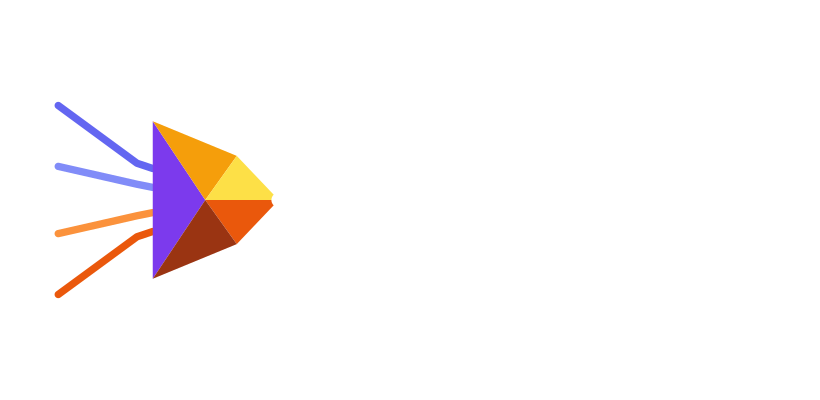

[](https://github.com/drmlStudio/drml/actions/workflows/ci.yml)

`drml` is an explicit package manager for JavaScript and TypeScript projects, built in Zig. It starts with a deliberately small promise: validate what a manifest says, record what happened, and fail clearly when compatibility is not implemented yet.

> **Status:** early development. The current milestone supports direct dependencies at exact versions and a source import checker. Expect the CLI and lockfile format to evolve.

## Why drml?

- **Native and focused:** a small Zig binary with no third-party Zig packages.

- **Explicit resolution:** exact `x.y.z` versions are validated instead of guessed around.

- **Inspectable state:** `drml-lock.json` records package versions and npm integrity metadata.

- **Useful feedback:** unsupported ranges, protocols, workspaces, and foreign lockfiles are explicit errors.

- **A wider direction:** the architecture leaves room for a resolver, store, linker, checker, compiler, test runner, and dev server.

## Quick start

Build with [Zig 0.15.2](https://ziglang.org/download/):

```
git clone https://github.com/drmlStudio/drml.git
cd drml
zig build
zig build run -- --help
```

Create or inspect a project manifest:

```
zig build run -- init
zig build run -- install
zig build run -- check
```

Use lockfile-only mode to validate a manifest and generate `drml-lock.json` without downloading packages:

```
zig build run -- install --lockfile-only
```

## Current commands

| Command | What it does |
| --- | --- |
| `drml init [directory]` | Create a minimal `package.json`. |
| `drml install` | Validate exact versions, resolve registry metadata, write the lockfile, and install direct packages. |
| `drml install --lockfile-only` | Generate a lockfile without network installation. |
| `drml check` | Find undeclared ESM, CommonJS, and literal dynamic-import packages. |

The installer understands `dependencies`, `devDependencies`, `optionalDependencies`, `peerDependencies`, and `peerDependenciesMeta`. It caches downloaded archives in `.drml-cache/` and records development and optional/peer flags in the lockfile.

## Deliberate boundaries

The current milestone refuses to silently guess for:

- semver ranges and unsupported dependency protocols

- workspace roots and nested workspace packages

- npm, pnpm, Yarn, and Bun lockfiles until import adapters exist

- transitive dependency solving, executable shims, lifecycle scripts, and lockfile reuse

- browser-only WebAssembly without a separate host adapter

These are planned compatibility surfaces, not hidden behavior.

## Development

Run the unit tests, native build, WASI build, and fixture matrix:

```
zig build test
zig build -Doptimize=ReleaseSafe
zig build -Dtarget=wasm32-wasi -Doptimize=ReleaseSafe
./tests/run-fixtures.sh
```

The fixture corpus covers ordinary manifests, invalid shapes, exact-version failures, foreign lockfiles, workspaces, package-manager metadata, source checking, and regression cases. Registry-backed fixtures are opt-in:

```
DRML_LIVE_TESTS=1 ./tests/run-fixtures.sh
./tests/run-live-install.sh
```

## Releases

Publishing a GitHub Release triggers `.github/workflows/release.yml`, which packages Linux x86_64/aarch64, macOS x86_64/aarch64, Windows x86_64, and WASI `wasm32-wasi` archives.

```
DRML_VERSION=0.1.0 DRML_ARCHIVE=linux-x86_64 ./scripts/package-release.sh
```

## Documentation site

The `website/` directory contains a plain-local Vue + VitePress site with a dark gradient visual system based on the drml logo:

```
cd website
npm install
npm run dev
```

## Contributing

Small, focused changes are welcome. Include a fixture for behavior changes, keep `zig fmt --check build.zig src` clean, and explain intentional compatibility boundaries in the README or docs.

## License

MIT © 2026 drml contributors. See [`LICENSE`](LICENSE).